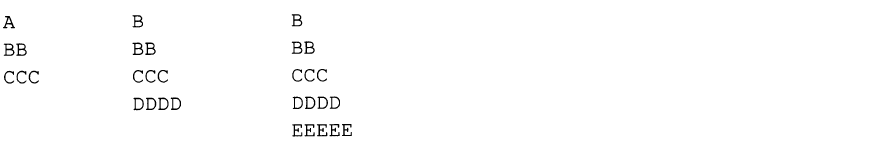

> Capítulo 4 - Exercícios Propostos

1. Indique quais afirmações são Falsas e quais são Verdadeiras:

   - 1.1 A condição dentro de um laço _while e do...while_ tem que ser colocada sempre dentro de parênteses.
   - 1.2 Os laços while e for executam SEMPRE, pelo menos uma vez, o corpo do laço.
   - 1.3 O laço do...while executa SEMPRE, pelo menos uma vez, o corpo do laço.
   - 1.4 As três componentes, dentro de parênteses, do laço for são todas obrigatórias.
   - 1.5 As três componentes, dentro de parênteses, do laço for são todas facultativas.
   - 1.6 Quando em um laço for se tem que realizar mais do que uma carga inicial ou mais do que um incremento, as diversas instruções, em cada uma das componentes, devem ser separadas por vírgula e não ponto-e-vírgula, de forma a manter o formato do laço for.
   - 1.7 A instrução de um laço é sempre executada.
   - 1.8 No laço for, o número de vezes que as cargas iniciais são executadas é sempre igual ao número de iterações do laço.
   - 1.9 No laço for ou while, o número de vezes que a condição é testada é sempre igual ao número de iterações do laço.
   - 1.10 No laço for, o número de vezes que a instrução é executada é sempre igual ao número de vezes que é executada a pós-instrução.
   - 1.11 Um laço, quando está dentro de outro laço, necessita de chaves.
   - 1.12 Não há limite para o número de laços dentro de outros laços.
   - 1.13 No laço do...while, a instrução é sempre executada pelo menos uma vez.
   - 1.14 Em todos os laços, a condição é sempre testada pelo menos uma vez.
   - 1.15 Os laços while e do...while incrementam automaticamente a variável de controle.
   - 1.16 Os laços são executados até que a condição escrita se verifique.
   - 1.17 O laço do...while aparece escrito menos frequentemente do que qualquer dos outros.
   - 1.18 Um break, quando presente dentro de um laço, termina o programa.
   - 1.19 No laço while, antes de se executar a instrução continue, deve-se atualizar a variável de controle do laço.
   - 1.20 Qualquer dos laços pode ser sempre escrito a partir do laço while.

2. Escreva genericamente o laço **do...while** como um laço **while**.

3. Escreva genericamente o laço **for** como um laço **while**.

4. Escreva genericamente o laço **while** como um laço **for**.

5. Qual a diferença de execução da instrução **break** quando presente em um **for** e em um **while**?

6. Qual a diferença de execução da instrução **continue** quando presente em um **for** e em um **while**?

7. Reescreva o seguinte trecho de um programa, utilizando o laço while:

```
for (i = 1; i <= 20; i++)
    if (i == 10)
        continue;
    else
        printf("%d\n",i);
```

8.  Escreva um programa que coloque na tela meia árvore de natal com asteriscos. O número de ramos deverá ser introduzido pelo usúario.

Exemplos com 3, 4 e 5 ramos:


9. Altere o programa anterior de forma que, em vez de asteriscos, sejam escritas letras em cada nível, começando o nível inicial com a letra 'A'.

Exemplos com 3, 4 e 5 ramos:



10. Escreva um programa que solicite um número ao usuário até que o valor deste esteja entre os valores 1 e 100.

11. Escreva um programa em C que escreva na tela toda a tabela ASCII (0...255 chars), escrevendo em cada linha o código ASCII e o caractere correspondente.

**Exemplo**:

    ...
    65 --> A
    66 --> B
    67 --> C
    ...

A fim de que o usuário possa ver todos os caracteres escritos, a tela deve ser parada de 20 em 20 linhas, até que o usúario pressione a tecla 'c' ou 'C' seguida de <<ENTER>> para continuar a mostrar os próximos 20 caracteres (20 linhas).

12. Escreva um programa completo em C que solicite ao usuário dois números inteiros entre 0 e 255 e escreva na tela todos os caracteres da tabela ASCII cujos códigos variem entre os dois números introduzidos, escrevendo em cada linha o código ASCII e o caractere correspondente.

**Exemplo**:

    ...
    Introd. um N° entre 0 e 255: 65 120
    65 --> A
    66 --> B
    67 --> C
    ...
    ...
    Introd. outro  N° entre 0 e 255: 120 65
    65 --> A
    66 --> B
    67 --> C
    ...

13. Qual a diferença (se existir) entre as duas seguintes instruções:

```
x = ++i e x = i++
```

Dê exemplos.

14. Se uma variável x se encontra isolada, ++x e x++ são equivalentes?

15. Pode-se utilizar os operadores ++ e -- em constantes?

16. Qual a diferença entre a = -2 e a -= 2?

17. Qual o resultado do seguite programa:

```c
n = 0;
do
    { printf(" ...");
      n = n+1;
    }
while (n != 0);
```

18. Qual a diferença entre os dois trechos de código:

```c
i = 0;
while (i++)
    printf("%d\n,i");
```

```c
i = 0;
while (++i)
    printf("%d\n,i");
```

19. O que faz o seguinte código:

```c
for (i = 1; i <= 200; i++) ;
    printf("%d\n", i);
```

20. Quantas vezes são executadas as instruções dos seguintes laços:

- 20.1

```c
for (i = 1; i <= 20; i++) ...
```

- 20.2

```c
for (i = 1; i <= 20; i+=2) ...
```

- 20.3

```c
for (i = -20; i <= 20; i++) ...
```

- 20.4

```c
for (i = 1; i <= 10; i++) ...
```

- 20.5

```c
for (j = 1; j <= 5; j++) ...
```

21. Preencha os espaços em branco com o valor das respectivas colunas, depois de executada a instrução à sua esquerda.

nota: Devem ser utilizados os valores alterados das variáveis em cada uma das linhas.

|              | x   | y   | z   |
| ------------ | --- | --- | --- |
|              | 5   | 10  | 7   |
| x++          |     |     |     |
| y\*=(z++ +2) |     |     |     |
| y=!x         |     |     |     |
| z=(x%2)+ --y |     |     |     |
| z=(x==y)     |     |     |     |
| !z           |     |     |     |
| z=z%8        |     |     |     |
