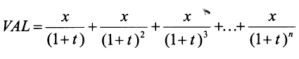

> Capítulo 5 - Exercícios Propostos

1. Indique se são verdadeiras ou falsas as seguintes afirmações:

   a) Uma função em C pode devolver simultaneamente mais do que um valor.
   b) Uma função em C pode não ter parâmetros.
   c) Uma função em C tem que devolver sempre um inteiro.
   d) Os parâmetros das funções podem ser do tipo void.
   e) A instrução return termina a execução de uma função.
   f) Uma variável local a uma função pode ter o mesmo nome que um parâmetro.
   g) A instrução return termina a execução de uma função apenas se for a última instrução da função em que se encontra.
   h) A instrução return, quando executada dentro de qualquer função, termina o programa.
   i) A instrução return, quando executada dentro da função main, termina o programa.
   j) O nome de uma função é opcional.
   k) Os parâmetros numa função são opcionais.
   l) Uma função deve fazer o maior número de tarefas possíveis sem ocupar muito código.
   m) Uma função não deve ter mais do que 10 linhas.
   n) O nome de uma função não deve ter mais do que 6 letras.
   o) O nome de uma função não pode ser uma reservada do C.
   p) Sempre que necessário devem ser utilizadas variáveis locais.
   q) Um protótipo não é nada mais que a repetição do cabeçalho da função seguido de;.
   r) Em C, um procedimento não é mais do que uma função que "retora void".

2. Identifique os erros de compilação que seriam detectados nos seguintes programas:

2.1

```c
f(int x, int y)
{
    x = 4;
    y = 5;
}
```

2.2

```c
void f(int x, int y)
{
    return -1;
}
```

2.3

```c
void f(void);
void f(int x, int y)
{
    x = 4;
    y = 5;
}
```

2.4

```c
f(int x, int y);
void f(int x, int y)
{
    x = 4;
    y = 5;
}
```

2.5

```c
void (int x, int y)
{
    x = 4;
    y = 5;
}
```

2.6

```c
void f(int x, y)
{
    x = 4;
    y = 5;
}
```

3. Dadas as funções Ping e Pong

```c
void Ping(int i)
{
    switch (i)
    {
    case 1:
    case 2:
    case 3:
        while (i--)
            printf("\n%d", --i);
        break;
    case 25:
        Pong(3);
        break;
    default:
        printf("\Já Passei em C");
        Pong(123);
    }
}
```

```c
void Pong(int x)
{
    int j = 0;
    switch (x)
    {
    case 1:
    case 2:
        Ping(x);
    case 3:
        j = 5;
        j++;
        return;
    default:
        printf("\nOla");
        return;
    }
    printf("\nVou Sair");
}
```

Qual a saída das seguintes chamadas:

    a) Pong(3);
    b) Ping(-4);
    c) Ping(25);
    d) Pong(2);
    e) Pong(1);

**Implemente as seguintes funções**:

4.

```
int Abs(int x)
```

Devolve o valor absoluto de x.

    Abs(-5) --> 5
    Abs(5)  --> 5

5.

```
float VAL(float x, int n, float t)
```

Devolve o VAL(Valor atual Líquido) para n anos, à taxa _t_ e é definido através da seguinte fórmula



Sugestão: Utiliza a função Plot, implementada anteriormente (Exercícios Resolvidos).

6.

```
long int n_segundo(int n_horas)
```

Devolve o número de segundos existente em um conjunto de horas.

    n_segundos(0)       --> 0
    n_segundos(1)       --> 3600
    n_segundos(2)       --> 7200

7.

```
long int num(int n_horas, char tipo)
```

Semelhante à função anterior, só que recebe mais um parâmetro indicando aquilo que se quer saber 'h' - Horas, 'm' - Minutos e 's' - Segundos.

    num(3, 'h')         --> 3
    num(3, 'm')         --> 180
    num(3, 's')         --> 10800

//\* Resolva este exercício de três formas distintas: com a instrução _if-else, switch_ com _break e switch_ sem _break_ \*//
Nota: Supõe-se que o tipo está sempre correto.

8.

```
float Max(float x, float y, float w)
```

Devolve o maior dos valores x, y e w.

9.

```
int Impar(int x)
```

Devolve Verdade se x for ímpar. Falso, no caso contrário.

10.

```
int Entre(int x, int lim_inf, int lim_sup)
```

Verifica se x se encontra no intervalo **lim_inf <= x <= lim_sup**

11. Escreva as seguintes funções

| Função                    | Devolve                                                                                  |
| ------------------------- | ---------------------------------------------------------------------------------------- |
| 11.1 int isdigit(char c)  | Verdade caso c seja um dígito. Falso, caso contrário.                                    |
| 11.2 int isalpha(char c)  | Verdade caso c seja um letra do alfabeto, maiúscula ou minúscula. Falso, caso contrário. |
| 11.3 int isalnum(char c)  | Verade caso c seja um dígito ou uma letra do alfabeto. Falso, caso contrário.            |
| 11.4 int islower(char c)  | Verdade caso c seja uma letra minúscula. Falso, caso contrário.                          |
| 11.5 int isupper(char c)  | Verdade caso c seja uma letra maiúscula. Falso, caso contrário.                          |
| 11.6 int isspace(char c)  | Verdade caso c seja um espaço ou TAB. Falso, caso contrário.                             |
| 11.7 char tolower(char c) | Devolve o valor do caractere c transformado em minúsculas.                               |
| 11.8 char toupper(char c) | Devolve o valor do caractere c transformado em maiúsculas.                               |

Nota:
Para ter acesso às funções apresentadas no exercício 11 bastará incluir no início do seu programa a linha

```c
#include <ctype.h> /* Funções sobre o tipo char (ctype =  char type) */
```

12.

```
int is_square(int x, int y)
```

Devolve um valor lógico que indica se x é ou não igual a y^2.

13.

```
int Minus(Valor)
```

Devolve o valor recebido sempre como número negativo

    Minus(10)           --> -10
    Minus(-10)          --> -10

14.

```
int is_special(int x)
```

Devolve um valor lógico que indica se o dobro de x é ou não igual a x^2.

15.

```
int Cubo(int x)
```

Devolve o valor de x^3.

16.

```
int IsVogal(char ch)
```

Verifica se ch é uma das vogais do alfabeto (minúscula ou maiúscula)
